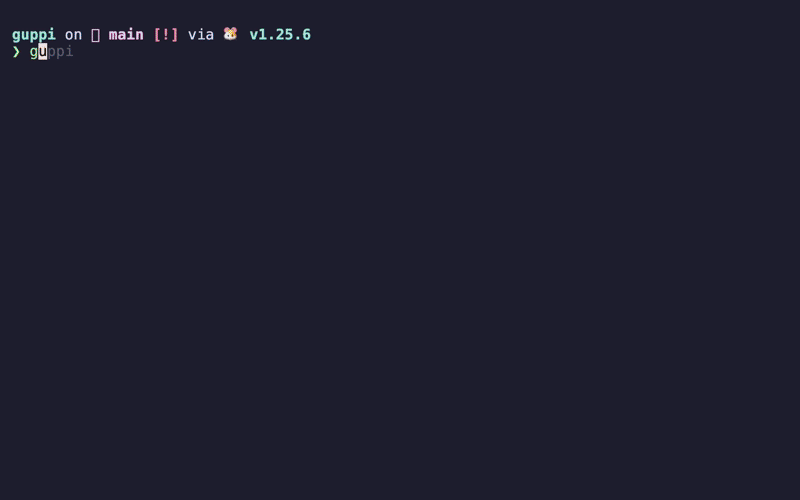
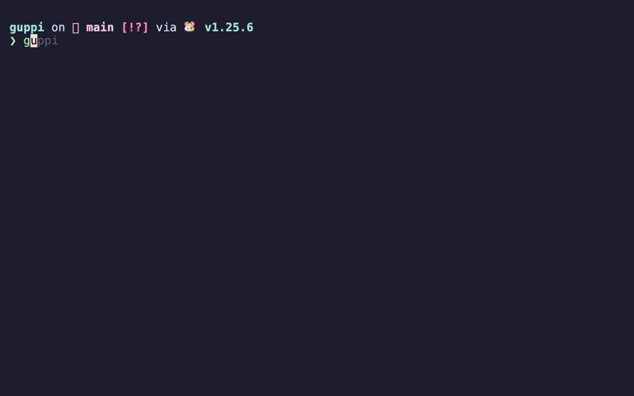

# guppi

A terminal UI for managing multiple git repositories.


> **Stop running `git pull` in 20 different terminals.**
>
> guppi gives you a single view of all your repositories - see what's changed, what's behind, and pull updates in seconds. Perfect for the morning "sync everything" routine.



## Features

- **Repository Overview** - View all repos with status, branch, and remote changes at a glance
- **Bulk Operations** - Pull repos individually, all favorites, or all repos behind remote
- **Smart Filtering** - Filter by name, dirty repos, or repos with pending updates
- **Branch Management** - Switch branches, create local tracking branches, delete local-only branches
- **Multi-pane Detail View** - See status, branches, and run commands in one view
- **Lazygit Integration** - Open lazygit for any repo with one keypress
- **Goto Feature** - Press `g` to cd into a repo directory
- **Performance Settings** - Configurable on-demand fetching for large repo collections

## Installation

### Prerequisites

- [Go](https://go.dev/dl/) 1.21 or higher

### Optional Dependencies

For the lazygit integration (`s` key), install [lazygit](https://github.com/jesseduffield/lazygit):

```bash
# macOS (Homebrew)
brew install lazygit

# Ubuntu/Debian
sudo apt install lazygit

# Arch Linux
sudo pacman -S lazygit
```

### Build from Source

```bash
# Clone the repository
git clone https://github.com/Quietscher/guppi.git
cd guppi

# Build
go build -o guppi .

# Run setup
./guppi --setup
```

### Install to PATH (optional)

```bash
# Option 1: Copy to a directory in your PATH
sudo cp guppi /usr/local/bin/

# Option 2: Add the guppi directory to your PATH
echo 'export PATH="$PATH:/path/to/guppi"' >> ~/.zshrc
```

### Setup Wizard

The setup wizard will:
1. Ask for your git repositories directory
2. Add a shell function to your `.zshrc`/`.bashrc` for the goto feature

After setup, run `source ~/.zshrc` (or restart your terminal) and use `guppi` from anywhere.

### Updating

```bash
cd /path/to/guppi
git pull
go build -o guppi .
```

## Usage

```bash
guppi              # Start the TUI
guppi --setup      # Re-run setup wizard
guppi --help       # Show help and key bindings
guppi --version    # Show version
```

### Environment Variables

- `GUPPI_GIT_DIR` - Override the git repositories directory

## Key Bindings

### List View

| Key | Action |
|-----|--------|
| `s` | Open lazygit for selected repo |
| `d` | Open detail view (multi-pane) |
| `f` | Toggle favorite |
| `p` / `Enter` | Pull selected repo |
| `P` | Pull all favorites |
| `A` | Pull all repos behind remote |
| `g` | Goto repo directory (cd) |
| `1` | Filter: repos with local changes |
| `2` | Filter: repos behind remote |
| `0` | Clear all filters |
| `/` | Search repos by name |
| `r` | Refresh (mode-aware: selected/favorites/all) |
| `ctrl+r` | Full refresh (always refreshes all repos) |
| `c` | Configure git directory |
| `S` | Open settings (performance options) |
| `q` | Quit |

### Detail View



| Key | Action |
|-----|--------|
| `Tab` | Switch pane (status/branches/command) |
| `↑/↓` | Scroll or select |
| `Enter` | Switch branch / Run command |
| `p` | Pull remote branch to local (create tracking) |
| `x` | Delete local-only branch |
| `X` | Force delete local branch |
| `r` | Refresh |
| `Esc` | Back to list |

### Branch Indicators

| Icon | Meaning |
|------|---------|
| `↕` | Local + Remote (synced) |
| `⚠` | Local only (no remote) |
| `☁` | Remote only (not checked out) |

## Status Indicators

- **Green ✓** - Clean, up to date with remote
- **Orange ↓** - Behind remote (can pull)
- **Orange ●** - Local changes (dirty)
- **Red ✗** - Error

## Configuration

Configuration is stored in `~/.config/guppi/`:

- `config.json` - Settings (git directory, performance options)
- `favorites.json` - List of favorite repositories

### Fetch Mode Settings

Press `S` in the list view to choose how guppi fetches repository status. Useful when managing many repositories:

| Mode | Description |
|------|-------------|
| Fetch all repos | Fetch all on startup; `r` refreshes all (default) |
| On-demand fetch | No auto-fetch; `r` refreshes selected, `ctrl+r` refreshes all |
| Favorites only | Fetch favorites on startup; `r` refreshes favorites, `ctrl+r` all |

## Dependencies

- [Bubble Tea](https://github.com/charmbracelet/bubbletea) - TUI framework
- [Bubbles](https://github.com/charmbracelet/bubbles) - TUI components
- [Lip Gloss](https://github.com/charmbracelet/lipgloss) - Style definitions

All dependencies are under permissive licenses (MIT/BSD 3-Clause).

## License

MIT
